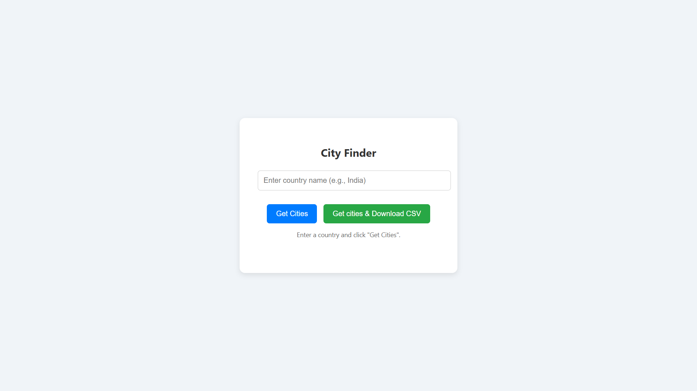
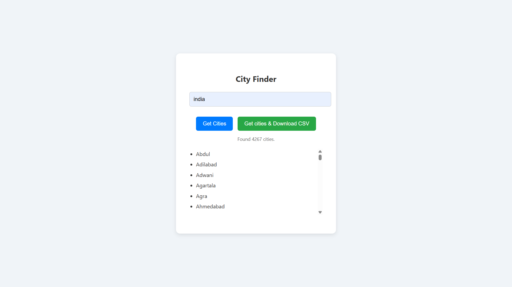

# City_Api

## Task Description
This project allows users to enter a country name and fetch a list of cities for that country using an external API. It also provides a feature to download the list of cities as a CSV file.

## Screenshot of Output

### 1. Home Page

### 2. After Fetching Cities

## Widget / Algorithm Used
- **Input Widget:** A text input field where the user types the country name.
- **Fetch API:** JavaScript `fetch` method is used to send POST requests to the Django backend.
- **Backend API Call:** Django server receives the request, makes an API call to `countriesnow.space` to get city data.
- **CSV Download:** When the download button is clicked, the backend sends the city data as a CSV file for the user to download.
- **Display:** The fetched cities are dynamically displayed as a list on the webpage.
